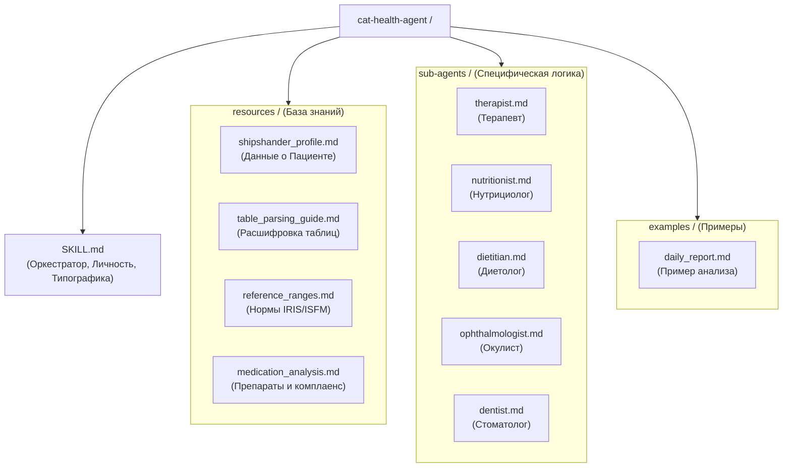

# Cat-Health-Agent

Оркестратор для мониторинга и анализа здоровья кота Шипшандера.

## Структура
- `SKILL.md` — Главные инструкции.
- `sub-agents/` — Узкие специалисты (Терапевт, Нутрициолог, Диетолог, Окулист, Стоматолог).
- `resources/` — База знаний и справочники.
- `examples/` — Примеры обработки.
