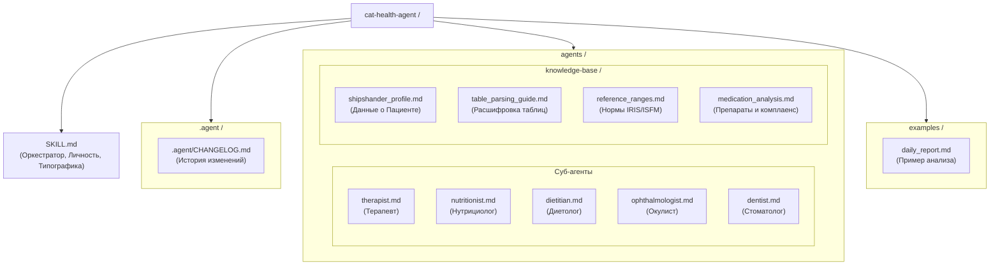

# Cat-Health-Agent

**Version: 1.0**
**Update date: 2026-04-06**

Оркестратор для мониторинга и анализа здоровья кота Шипшандера.

## Структура
- `SKILL.md` — Главные инструкции (Оркестратор).
- `.agent/` — Системная папка проекта (CHANGELOG).
- `agents/` — Узкие специалисты (Терапевт, Нутрициолог, Диетолог, Окулист, Стоматолог).
- `agents/knowledge-base/` — База знаний и справочники.
- `examples/` — Приемы и примеры анализа.
